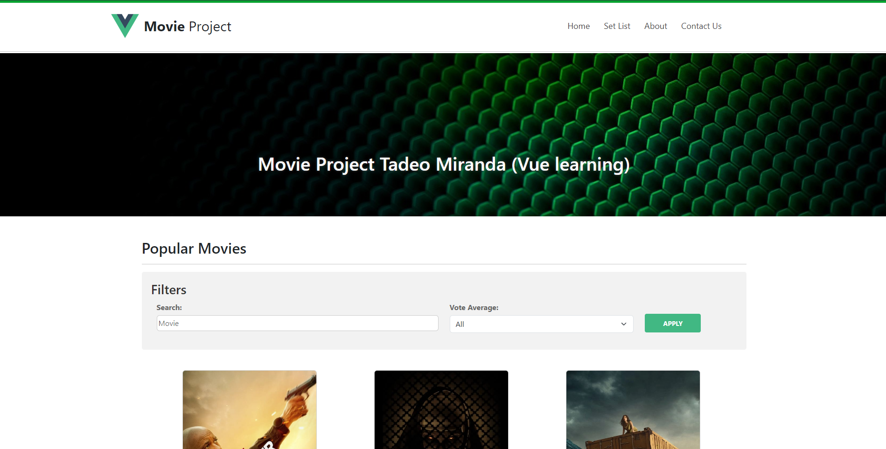
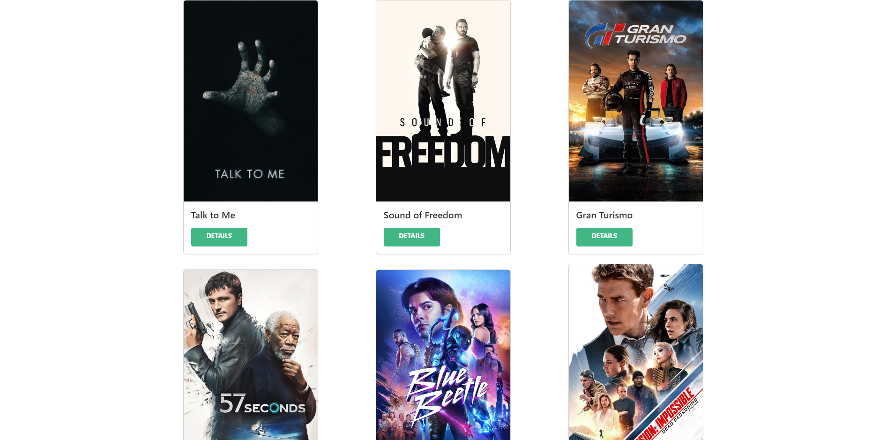
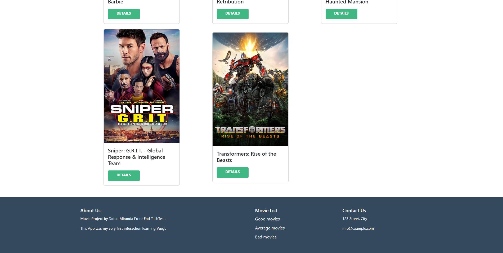
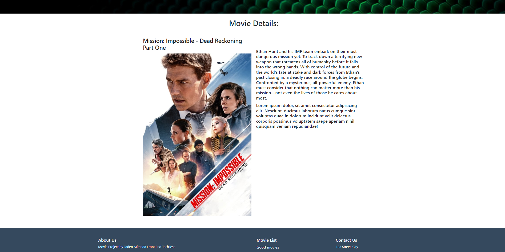
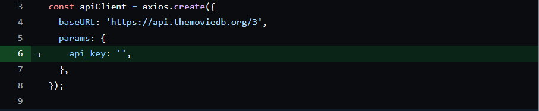

# Vue Movie Project - Frontend Technical Interview

This project was developed as part of a technical interview for a Frontend Developer position at a real estate company in Mexico City (They decided not to move forward with my application and I didn't get the job, by the way). The application aims to simulate a movie streaming service and fetches data from a movie API (themoviedb.org) to display information about available movies.

## Description

It is a simple web application that allows users to explore and view information about movies of various genres. It uses an API (themoviedb) to obtain real-time data about movies, such as title, release year, genre, and synopsis. It also features a filter in the main menu to refine the selection of movies by genre, rating, etc.

## Features

- Displays a list of popular movies.
- Allows users to view details of a specific movie.
- Movie filtering
- Attractive and user-friendly user interface.

## Screenshots

_Main menu, navbar, and filter bar._

_Main Menu body._

_Footer._

_Individual movie screen._

## Installation

- Clone this repository.
- Run `npm install` to install the dependencies.
- Set up your API key.
- Run `npm run serve` to start the application.

## API Key

### Get your API Key

Go to [themoviedb.org](https://developer.themoviedb.org/reference/intro/getting-started) and Authenticate to get your API Key (Also to check the API documentation).

### Set up the key

_api.js._

## Technologies Used

- Vue
- Bootstrap

## Contact

For questions or to connect, you can also visit [my LinkedIn profile](https://www.linkedin.com/in/miranda10am/).
